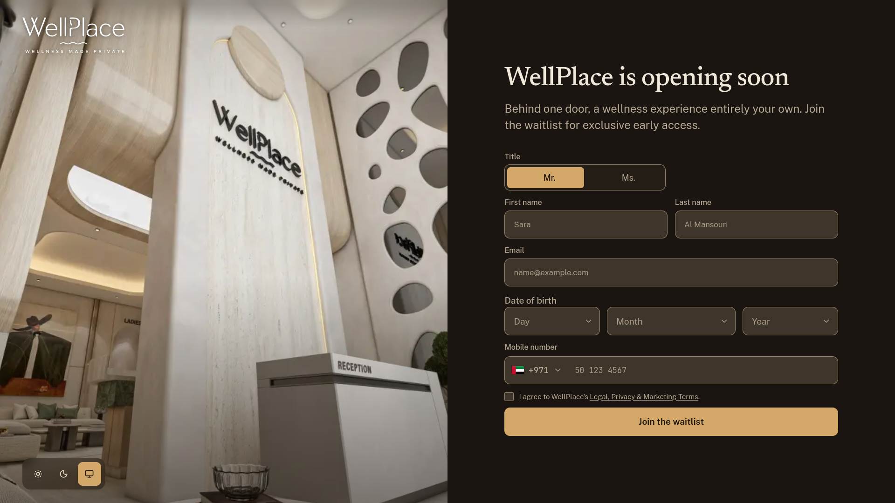
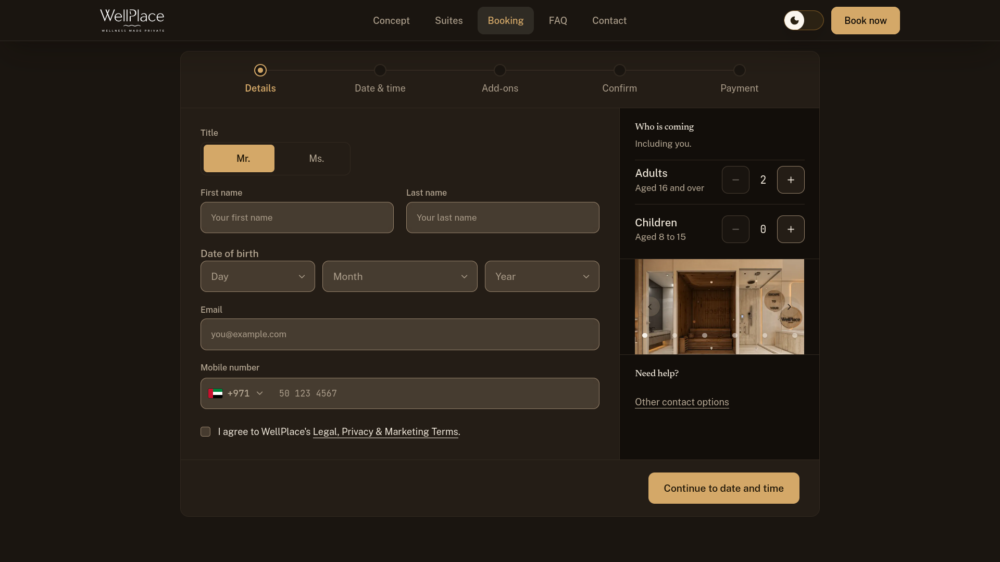
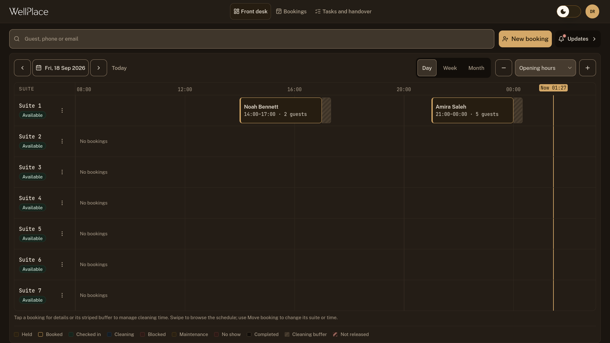
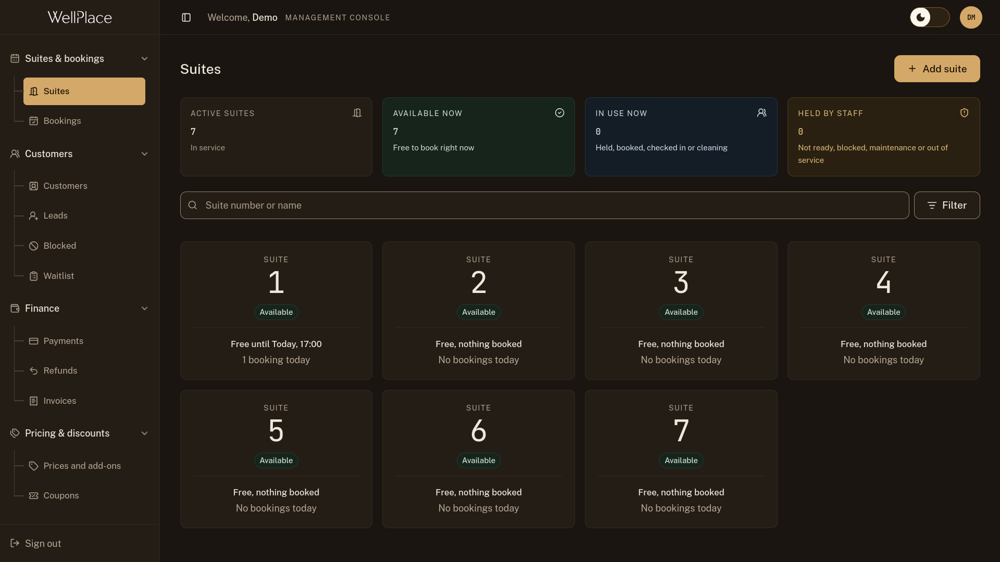

# WellPlace

**Wellplace is a suite booking website with management and reception console**

WellPlace is a booking and management system for a venue with private suites.
Guests book and pay on the website. The front desk runs the day from the
**Reception** screen. Owners and managers set prices, look after customers and
keep track of money from the **Management** screen


## Why I built it

I built WellPlace for my family's wellness suites as we couldn't find some better CMS online so I thought to build the website on own. so this is like a personal website 

This repository holds the complete system. You can
download it and click through every screen 

## Guide

WellPlace has four parts as

### 1. The public website

Guests see this part. It has a home page and pages for the concept, the suites,
FAQs, contact details and the legal terms


The website can run in one of two modes:

- **Full mode** is the normal website, with online booking open.
- **Waitlist mode** is a single "opening soon" page



The people who sign up show up in the Management screen under **Customers →
Waitlist**

### 2. Online booking


A guest books in a few steps:

1. Pick a date and an arrival time.
2. Choose a suite.
3. Add the other guests and any extras.
4. Enter a coupon code, if they have one.
5. Pay and get a receipt.

WellPlace checks the rules along the way, so a guest can't book something that
won't work. It never double books a suite. It leaves time for cleaning between
bookings. It won't let more people into a suite than the suite holds. It works
out adult and child prices, VAT, and the extra charge when someone stays past
their time.


### 3. Reception 



The front-desk team works from this screen. It shows today's schedule for every
suite on one timeline, so you can see at a glance who is in, who is arriving
next and which suites are free.

**Reading the board**

- Each row is one suite.
- Each block is one booking, showing the guest's name, the time and how many
  people are coming. Click a block to see the details.
- The striped area after a booking is the cleaning time before the next guest.
  Click it to change how long cleaning takes.
- The **Now** line marks the current time.
- Use **Day**, **Week** and **Month** at the top to zoom in or out, and the
  arrows to move between days.
- The colour key at the bottom tells you each booking's status: held, booked,
  checked in, cleaning, no-show, and so on.


### 4. Management 

This screen is for owners and managers. It holds everything about how the
business runs




## Try it 
I've made some demo accounts for the users to test the website: 

| Sign in as | Email | Password | You'll land on |
|---|---|---|---|
| A manager | `manager@wellplace.example` | `demo-manager-2026` | The Management screen |
| The front desk | `reception@wellplace.example` | `demo-reception-2026` | The Reception board |


---

## Getting started


### Step 1: Download the code

```bash
git clone https://github.com/Hamna-mubarak01/wellplace.git
cd wellplace
npm install
```

### Step 2: Start the database

```bash
npx supabase start
```

### Step 3: Add your settings


```bash
cp .env.example .env
```
---
If you have any question or suggestion please email me :)